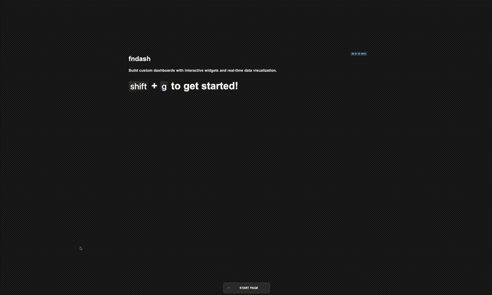

# fndash

A modern, customizable dashboard system with dynamic grid layout and real-time widget management.

## Demo



*Complete dashboard workflow - grid management, widget creation, dashboard switching, and mode transitions*


*Watch the dashboard in action - dynamic grid resizing, widget management, and real-time configuration*


*Additional demo showcasing custom widgets, configuration panels, and advanced features*

## Features

- **Dynamic Grid System** - Adjustable columns, rows, gap, and styling with no widget duplication on resize
- **Dashboard Management** - Save, load, and switch between multiple dashboards with localStorage persistence
- **Widget Management** - Drag, resize, configure, duplicate, and delete widgets with hover controls
- **Map Synchronization** - Real-time map sync with multiple modes (All Leaders, Primary Leader)
- **Sunburst Charts** - Interactive hierarchical data visualization with ECharts and multiple data sources
- **Custom Widgets** - AI-generated widgets with JSON configuration and localStorage persistence
- **RichText Widgets** - HTML content widgets with dynamic positioning for edit/view modes
- **Dev Widgets** - Developer instruction widgets visible only in edit mode
- **Background Customization** - Real-time background color picker in toolbar
- **Widget Controls** - Hover-based controls for move, config, duplicate, delete
- **Keyboard Shortcuts** - Efficient navigation and control including dashboard creation
- **Mode Switching** - Toggle between edit and view modes with smooth toolbar transitions
- **Real-time Updates** - Live configuration panels and position tracking
- **WebGL Context Management** - Prevents context leaks and crashes during grid operations
- **Change Detection** - Visual indicators for unsaved changes with smart save states

## Quick Start

1. Clone the repository
2. Open `index.html` in a modern browser
3. Use the toolbar to adjust grid settings
4. Add widgets and configure them via the gear icon
5. Create custom widgets with JSON configuration

## Keyboard Shortcuts

- `Shift + G` - Toggle grid visibility and edit/view mode
- `Shift + ?` (or `Shift + /`) - Toggle add widget menu
- `Shift + N` - Create new dashboard
- `Cmd + Shift + Arrow Keys` - Adjust grid dimensions
- `ESC` - Deselect widgets or close menus

## Architecture

```
fndash/
├── script.js              # Grid system & coordination with widget preservation
├── config-panel.js        # Widget configuration management
├── widget-manager.js      # Widget lifecycle & interactions
├── keyboard.js            # Keyboard shortcuts
├── widgets/
│   ├── WidgetCore.js      # Base widget class
│   ├── map-widget.js      # Mapbox integration (attribution removed)
│   ├── chart-widget.js    # Chart widget with config panel
│   ├── sunburst-widget.js # ECharts sunburst visualization with data sources
│   ├── custom-widget.js   # AI-generated custom widgets with JSON editor
│   ├── map-sync.js        # Map synchronization
│   └── widget.css         # Widget styling with consistent info sections
├── style.css              # Main application styles with text selection prevention
├── prompt.md              # AI prompt templates for custom widgets
└── index.html
```

## Widget Types

- **Map Widget** - Interactive maps with Mapbox GL JS (attribution removed)
- **Sunburst Widget** - Hierarchical data visualization with ECharts and multiple data sources
- **Chart Widget** - Data visualization with ECharts (placeholder with config panel)
- **RichText Widget** - HTML content display with dynamic positioning for edit/view modes
- **Dev Widget** - Developer instructions and keyboard shortcuts (edit mode only)
- **Custom Widget** - AI-generated widgets with JSON configuration and localStorage persistence

## Custom Widgets

Create powerful custom widgets using JSON configuration:

### JSON Structure
```json
{
  "title": "Widget Name",
  "description": "Description",
  "html": "Complete HTML with unique IDs",
  "css": "Modern CSS with animations",
  "js": "Interactive functionality with data updates",
  "settings": { "backgroundColor": "#1a1a1a", ... },
  "layout": { "minWidth": 3, "minHeight": 3, ... },
  "interactions": { "clickable": true, ... },
  "data": { "source": "static", "refreshInterval": 3000, ... }
}
```

### Usage
1. Add a Custom Widget from the widget menu
2. Click the gear icon to open configuration
3. Paste your JSON configuration in the JSON field
4. Widget updates automatically when valid JSON is detected
5. Save your custom widget for future use with localStorage persistence

## Configuration

Widgets can be configured through the gear icon:
- **Widget Info** - ID, type, and position display
- Position and size adjustment
- Map synchronization settings
- Sunburst chart data sources and visual settings
- Custom widget JSON configuration with full-height editor
- Style and behavior options

## Widget Controls

Each widget has hover controls:
- **Move** - Drag to reposition
- **Configure** - Open settings panel
- **Duplicate** - Copy widget with all settings
- **Delete** - Remove widget instantly

## Technologies

- **Vanilla JavaScript** - No frameworks, pure performance
- **CSS Grid** - Modern layout system
- **Mapbox GL JS** - Interactive maps
- **ECharts** - Data visualization library
- **Lucide Icons** - Clean iconography
- **JSON Configuration** - Flexible widget system

## Map Synchronization

Two synchronization modes:
- **All Leaders** - Any map can become the leader
- **Primary Leader** - One designated map controls all others

## Dashboard Management

- **Save Dashboards** - Save current grid and widget configuration with custom names
- **Load Dashboards** - Switch between saved dashboards with dropdown menu
- **Create New Dashboards** - Use `Shift + N` or dropdown menu to create empty dashboards
- **Change Detection** - Visual indicators show when dashboards have unsaved changes
- **localStorage Persistence** - All dashboards saved locally in browser
- **Default Dashboards** - Pre-configured "START PAGE" and "FINANCE" dashboards

## Customization

- Adjustable grid dimensions (1-12 columns/rows)
- Customizable gap, padding (max 500px), and border radius (max 800px)
- Real-time background color picker in toolbar
- Real-time visual feedback
- Responsive design
- Custom widget creation with AI assistance
- Consistent widget information sections across all widget types
- Compact configuration panel headers
- Dynamic widget positioning based on edit/view mode
- MacBook-style keycap styling for keyboard shortcuts

## AI Integration

The system supports AI-generated custom widgets:
- Use the prompt templates in `prompt.md`
- Generate JSON configurations with AI
- Paste configurations directly into custom widgets
- Save and reuse custom widget configurations with localStorage

---

Built for modern web applications
